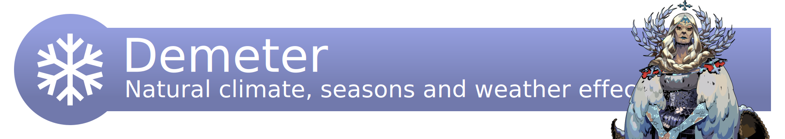

# Demeter

Natural climate, seasons and weather effects for Paper

--- 

This plugin provides several features which imitate real-life natural effects,
such as seasons, weather types, and temperature.

## Setup

### Dependencies

* [Java >=16](https://adoptopenjdk.net/?variant=openjdk16&jvmVariant=hotspot)
* [Paper >=1.17](https://papermc.io/)
* [ProtocolLib >=4.6.0](https://www.spigotmc.org/resources/protocollib.1997/)
* [Minecommons >=1.3](https://gitlab.com/aecsocket/minecommons)

### [Download](https://gitlab.com/aecsocket/demeter/-/jobs/artifacts/master/raw/paper/build/libs/demeter-paper-1.0.jar?job=build)

## Use

### Configuration

The default configuration file is thoroughly documented. See [here](paper/src/main/resources/settings.conf).

### Commands

#### Permissions

For each command, the permission node is `demeter.command.[path-to-command]`.

E.g. `/demeter seasons time set` -> `demeter.command.seasons.time.set`

#### Format

* `<required argument>` 
* `[optional argument]`

#### Commands

* `/demeter` alias `/dem`
  * `help` shows usage information (regardless of permission)
  * `version` shows version information (regardless of permission)
  * `reload` reloads the plugin's configuration files
  * `time-dilation`
    * `status [world]` shows time info for a world, defaults to the sender's world
  * `seasons`
    * `get [world] [biome]` gets the season for a world and a biome, defaults to the sender's location
    * `set <season> [world] [biome]` sets the season clock for a world to correspond to the start of a season
    * `timeline [world]` shows a timeline of seasons for either a specific world, or all configured worlds
    * `time`
      * `get [world]` gets the season clock for a world
      * `set <time> [world]` sets the season clock for a world, with time expressed as a duration

## Q & A

**Q:** Why was this plugin renamed from Natura to Demeter?

**A:**
* Using "Natura" would give me terrible SEO since a popular mod already exists with the same name.
* Also because I played Hades.
